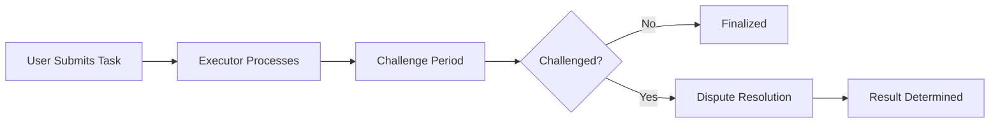

# Aethelred Protocol

<div align="center">

[](https://opensource.org/licenses/MIT)
[](https://www.rust-lang.org)
[](https://arbitrum.io/)

**🧠 Verifiable Intelligence Network**

*Decentralized AI computation with cryptographic guarantees*

[Documentation](#documentation) • [Getting Started](#getting-started) • [Architecture](#architecture) • [Contributing](#contributing)

</div>

## 🌟 Overview

Aethelred is a revolutionary **Verifiable Intelligence Network** that enables decentralized AI computation with cryptographic guarantees. Built on Arbitrum using Stylus, Aethelred creates a trustless marketplace where AI tasks can be executed off-chain while maintaining on-chain verification and dispute resolution.

### ✨ Key Features

- **🔍 Verifiable Execution**: Cryptographic proofs ensure AI computation integrity
- **⚖️ Interactive Dispute Resolution**: Bisection protocol for fraud prevention
- **🏪 AI Model Marketplace**: Decentralized registry of open-source AI models
- **⭐ Proof of Quality (PoQ)**: Community-driven quality assessment system
- **💰 Token Economics**: AETHEL token for staking, payments, and governance
- **🌐 DePIN Integration**: Decentralized Physical Infrastructure Network for AI

## 🚀 Getting Started

### Prerequisites

- [Rust](https://rustup.rs/) (1.70+)
- [Docker](https://docs.docker.com/get-docker/) & [Docker Compose](https://docs.docker.com/compose/install/)
- [Git](https://git-scm.com/downloads)

### Quick Start

1. **Clone the repository**
   ```bash
   git clone https://github.com/aethelred-protocol/aethelred.git
   cd aethelred
   ```

2. **Set up development environment**
   ```bash
   make setup-dev
   ```

3. **Start local development environment**
   ```bash
   make dev-start
   ```

4. **Set up your node**
   ```bash
   make setup-node
   ```

5. **Run your node**
   ```bash
   make run-executor
   ```

### Alternative: Manual Setup

<details>
<summary>Click to expand manual setup instructions</summary>

1. **Install dependencies**
   ```bash
   cargo install cargo-stylus
   ```

2. **Build the project**
   ```bash
   make build
   ```

3. **Run tests**
   ```bash
   make test
   ```

4. **Deploy to testnet**
   ```bash
   export PRIVATE_KEY=your_private_key_here
   make deploy
   ```

</details>

## 🏗️ Architecture

Aethelred implements an **Optimistic Inference** framework with the following components:

### Smart Contracts

- **AethelCore**: Main protocol contract handling tasks, disputes, and quality assessment
- **AethelToken**: ERC-20 token for network economics

### Off-Chain Infrastructure

- **Executor Nodes**: Process AI computations and submit results
- **Verifier Nodes**: Validate results and initiate challenges when fraud is detected
- **Finalizer Nodes**: Complete tasks after challenge periods expire
- **Quality Assessor Nodes**: Evaluate and score AI output quality

### Key Protocols

#### 1. Task Execution Flow



#### 2. Interactive Dispute Resolution

Uses a **bisection protocol** to efficiently resolve disputes:
- Challenger and executor narrow down the computation step where they disagree
- Single computation step is verified on-chain
- Fraudulent party is slashed, honest party receives rewards

#### 3. Proof of Quality (PoQ)

Community-driven quality assessment:
- Multiple assessors evaluate AI outputs
- Quality scores influence model reputation
- High-quality models receive preferential selection

## 📚 Documentation

### Core Concepts

- [**Protocol Overview**](docs/protocol-overview.md) - High-level system design
- [**Token Economics**](docs/tokenomics.md) - AETHEL token mechanics
- [**Dispute Resolution**](docs/dispute-resolution.md) - Interactive fraud proofs
- [**Quality Assessment**](docs/quality-assessment.md) - PoQ system details

### Technical Guides

- [**Smart Contract API**](docs/api/contracts.md) - Contract interfaces and functions
- [**Node Operations**](docs/node-guide.md) - Running different node types
- [**Model Registration**](docs/model-marketplace.md) - AI model marketplace guide
- [**Integration Guide**](docs/integration.md) - Building applications on Aethelred

### Deployment

- [**Local Development**](docs/development.md) - Setting up local environment
- [**Testnet Deployment**](docs/testnet.md) - Deploying to Arbitrum Sepolia
- [**Mainnet Guide**](docs/mainnet.md) - Production deployment

## 🛠️ Usage Examples

### Submit an AI Task

```rust
// Submit a text generation task
let task_id = core_contract.submit_task(
    model_hash,     // Hash of the AI model
    input_hash,     // Hash of input data
    fee_amount,     // Payment in AETHEL tokens
).await?;
```

### Register an AI Model

```bash
# Register a Hugging Face model
cargo run --bin aethelred-node -- register-model \
    --model-hash "abc123..." \
    --uri "https://huggingface.co/gpt2" \
    --fee "10"
```

### Run Different Node Types

```bash
# Run as executor
cargo run --bin aethelred-node -- run executor

# Run as verifier
cargo run --bin aethelred-node -- run verifier

# Run as quality assessor
cargo run --bin aethelred-node -- run assessor
```

## 🔧 Development

### Project Structure

```
aethelred/
├── contracts/          # Smart contracts
│   ├── aethel_core/   # Main protocol contract
│   └── aethel_token/  # ERC-20 token contract
├── node/              # Off-chain node implementation
├── scripts/           # Deployment and utility scripts
├── tests/             # Comprehensive test suite
├── docs/              # Documentation
└── docker/            # Docker configurations
```

### Available Commands

```bash
# Development
make build              # Build all components
make test               # Run test suite
make format             # Format code
make lint               # Run linting

# Deployment
make deploy             # Deploy to testnet
make deploy-local       # Deploy to local Anvil
make populate           # Populate marketplace with HF models

# Docker
make docker             # Start development environment
make dev-start          # Full development setup
make monitor            # Open monitoring dashboard

# Node operations
make run-executor       # Run executor node
make run-verifier       # Run verifier node
make stake AMOUNT=1000  # Stake tokens
```

### Testing

Run the comprehensive test suite:

```bash
# Basic tests
make test

# Full test suite with coverage
./scripts/run-tests.sh --coverage --stress

# Integration tests only
./scripts/run-tests.sh --no-integration
```

## 🌍 Community & Ecosystem

### AI Model Marketplace

Aethelred comes pre-populated with **28 popular open-source AI models** from Hugging Face:

- **Text Generation**: GPT-2, DialoGPT, BlenderBot
- **Image Classification**: Vision Transformer, ResNet, DeiT
- **Code Models**: CodeBERT, CodeGen, CodeGPT
- **Multimodal**: CLIP, GIT
- **Specialized**: BART, T5, Translation models

### Contributing

We welcome contributions! See our [Contributing Guide](CONTRIBUTING.md) for details.

1. Fork the repository
2. Create a feature branch
3. Make your changes
4. Add tests
5. Submit a pull request

### Community

- [Discord](https://discord.gg/aethelred) - Community chat
- [Twitter](https://twitter.com/aethelred_ai) - Updates and announcements
- [GitHub Discussions](https://github.com/aethelred-protocol/aethelred/discussions) - Technical discussions

## 📈 Roadmap

### Phase 1: Core Protocol ✅
- [x] Basic task execution and verification
- [x] Interactive dispute resolution
- [x] AI model marketplace
- [x] Quality assessment system

### Phase 2: Enhanced Features 🚧
- [ ] Privacy-preserving computation (zk-SNARKs)
- [ ] Multi-chain deployment
- [ ] Advanced ML model support
- [ ] Governance mechanisms

### Phase 3: Ecosystem Growth 🔮
- [ ] Developer tools and SDKs
- [ ] Enterprise partnerships
- [ ] Academic collaborations
- [ ] Mobile applications

## 📊 Metrics & Monitoring

Aethelred includes comprehensive monitoring:

- **Grafana Dashboard**: Real-time metrics and alerts
- **Prometheus**: Metrics collection and storage
- **Health Checks**: Node status and performance monitoring
- **Gas Optimization**: Transaction cost tracking

Access the monitoring dashboard at `http://localhost:3000` when running the development environment.

## 🔒 Security

### Audit Status

- [ ] Internal security review
- [ ] External security audit
- [ ] Bug bounty program

### Security Features

- **Access Controls**: Role-based permissions
- **Input Validation**: Comprehensive parameter checking
- **Reentrancy Protection**: Guard against common attacks
- **Gas Optimization**: Efficient contract execution

### Reporting Security Issues

Please report security vulnerabilities to [security@aethelred.ai](mailto:security@aethelred.ai).

## 📄 License

This project is licensed under the MIT License - see the [LICENSE](LICENSE) file for details.

## 🙏 Acknowledgments

- **Arbitrum Team** for Stylus and L2 infrastructure
- **Hugging Face** for open-source AI models
- **Rust Community** for excellent tooling
- **Ethereum Foundation** for foundational research

---

<div align="center">

**Built with ❤️ by the Aethelred Team**

[Website](https://aethelred.ai) • [Documentation](https://docs.aethelred.ai) • [Discord](https://discord.gg/aethelred)

</div>